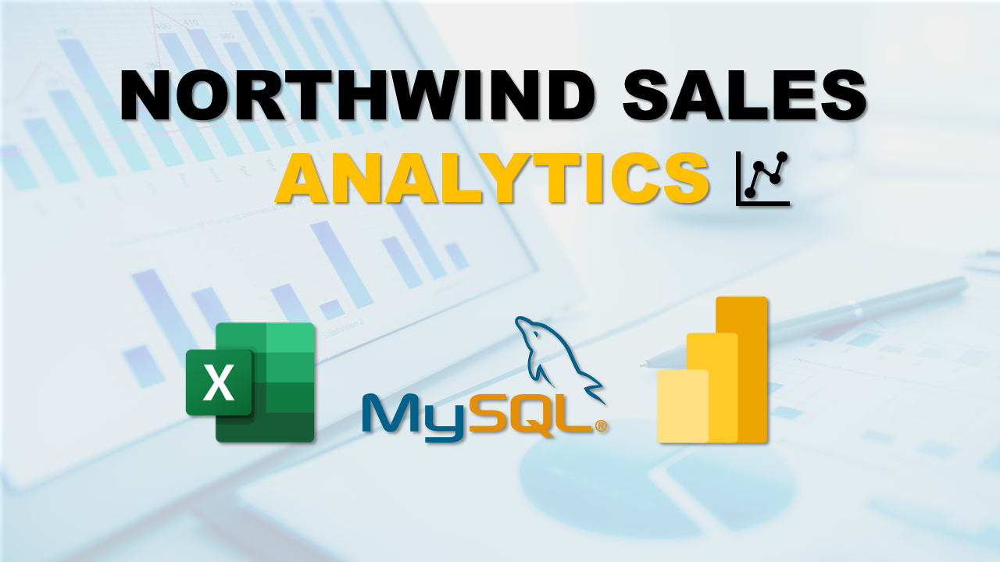

# Northwind Data Analytics Project

This repository showcases my **Northwind Data Analytics Project**, where I used **SQL, Excel, and Power BI** to uncover insights from the classic Northwind retail dataset.

## 🎥 Video Walkthrough

# Click the thumbnail above to watch the **unlisted video walkthrough** on YouTube.

## 📊 Project Highlights

- **SQL (MySQL):** Performed data extraction and transformation across multiple related tables.
- **Excel:** Conducted Exploratory Data Analysis (EDA), created pivot tables and charts to discover trends.
- **Power BI Dashboards:**
  - 📈 **Sales Dashboard** – KPIs (Total Sales, Orders, AOV), trends by month, sales by category and region.
  - 👥 **Customer Segmentation** – High/Mid/Low-value segments, country-wise order analysis.
  - 📦 **Inventory Analysis** – Stock levels by category, products below reorder level, discontinued items.
  - 🧑‍💼 **Employee Performance** – Orders handled by employee, sales vs targets, regional performance.
  - 🚚 **Shipping & Fulfillment** – Freight costs, average shipping durations, regional freight grouping.

## 📁 Files Included
- Power BI (.pbix) file – All dashboards and data model
- Excel (.xlsx) – EDA outputs and summary charts (optional)
- README – Project overview

---

*This project demonstrates how structured analytics and visualization can transform raw retail data into actionable business insights.*
